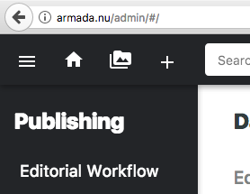

# ADD YOUTUBE VIDEO
To add a movie in an article or on a page the link has to be surrounded by the div tag as in the example below:

```html
<div class="youtube-movie">
<iframe src="https://www.youtube.com/embed/13wjnqn6V7M" frameborder="0" allowfullscreen></iframe>
</div>
```


# UPLOAD FILE
To add a file (document or image etc), go to www.armada.nu/admin and log in with your github account. Click the image icon (image 1), click upload (image 2) and search for the file you want to add.

Image 1


Image 2

